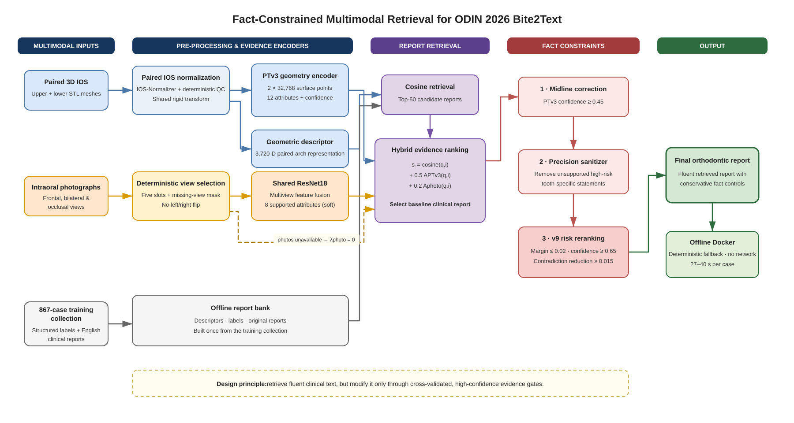

# ODIN 2026 Bite2Text

Reproducible source code and deployment entry points for `shayne`'s individual
submission to [ODIN 2026 Task 2 — Bite2Text](https://odin2026.grand-challenge.org/).
The method was developed by **YanSun**.

The final v9 system combines standardized intraoral-scan geometry, a Point
Transformer V3 (PTv3) structured predictor, multiview photographic evidence,
clinical-report retrieval, precision-oriented fact filtering, and conservative
contradiction-risk reranking.

## Method overview



The editable source is available in
[`ODIN2026_Task2_Technical_Route.drawio`](figures/ODIN2026_Task2_Technical_Route.drawio).

## Final v9 configuration

| Component | Frozen setting |
|---|---:|
| Geometry retrieval | 3,720-D descriptor, cosine top-50 |
| PTv3 evidence | 12 heads, agreement coefficient `0.5` |
| Photo evidence | five views, 8 supported heads, coefficient `0.2` |
| Midline correction | confidence threshold `0.45` |
| Candidate score margin for risk reranking | `0.02` |
| Contradiction confidence threshold | `0.65` |
| Unsupported-sentence penalty | `0.005` |
| Contradiction-risk penalty | `0.5` |
| Minimum contradiction improvement | `0.015` |

On strict patient-separated five-fold out-of-fold evaluation over 867 labeled
cases, v9 obtained BLEU-4 `0.2684` and METEOR `0.4700`. These are development
results, not organizer-reported hidden-test RadFact scores.

## Repository structure

- `task2_bite2text/ptv3_finetune/`: PTv3 data preparation, training, and OOF evaluation.
- `task2_bite2text/photo_pipeline/`: multiview-photo training and multimodal evaluation.
- `task2_bite2text/hybrid_submission_v9_final/`: final Grand Challenge inference layer.
- `task2_bite2text/labeling/`: structured-label parser and schema.
- `task2_bite2text/radfact_glm_eval/`: local RadFact-Lite proxy adapter.
- `scripts/`: input auditing, IOS-normalization QA, and local smoke-test utilities.

Older submission directories are retained to document the progression from
geometry-only retrieval to the final multimodal, fact-constrained system.

## Reproducibility scope

This repository intentionally excludes challenge data, patient-level records,
clinical-report banks, trained weights, Docker exports, and generated
experiment artifacts. Consequently, cloning the repository is sufficient to
inspect and test the source, but **not** to reproduce the exact submitted image
without separately authorized model and data assets.

The excluded v9 model directory must contain:

```text
model/
├── config.py
├── head_vocabs.json
├── model_final.pth
├── photo_model_final.pt
├── photo_view_classifier.pt
├── retrieval_index.npz
├── retrieval_labels.json
└── retrieval_reports.json
```

The retrieval reports and labels are derived from challenge training data and
must be regenerated or obtained under the applicable challenge license. The
full-data PTv3 checkpoint used for the submitted model has SHA-256
`d7f3be80fadc361248b970a85861660ad527d7cf5e82232e563fb1fe363c6811`.

## Source-level validation

The final decision controls can be tested in a Python environment containing
NumPy and PyTorch:

```bash
cd task2_bite2text/hybrid_submission_v9_final
python3 -m unittest -v test_report_sanitizer.py test_risk_rerank.py
```

Expected result: 11 tests pass. These tests cover the high-precision sentence
filter and the conservative v9 candidate-replacement gate; they do not require
challenge data or model weights.

## Container assembly

Requirements:

- Linux/amd64 Docker with Buildx;
- NVIDIA Container Toolkit and a CUDA-capable GPU for end-to-end inference;
- at least 16 GB host memory for the validated runtime profile;
- the local base image `odin2026-bite2text-hybrid-debug-v5`;
- the eight model assets listed above.

The public v9 Dockerfile contains the final code layer and frozen environment
variables, but derives from the local v5/PTv3 image chain used during the
challenge. With that base image available:

```bash
cd task2_bite2text/hybrid_submission_v9_final
docker image inspect odin2026-bite2text-hybrid-debug-v5 >/dev/null
./do_build.sh
```

For a local end-to-end test, place one case under the official input layout and
mount the model assets through the supplied script:

```bash
export BITE2TEXT_TEST_INPUT_ROOT=/path/to/test/input
export BITE2TEXT_TEST_CASE=CASE_ID
export BITE2TEXT_TEST_GPU=0
./do_test_run.sh
```

The script runs with `--network none`, a 16 GB memory limit, and one GPU. It
verifies that the output is a non-empty JSON object at
`diagnostic-imaging-report.json` with exactly one `report` field.

## Input and output contract

The final container accepts paired upper/lower IOS meshes and an intraoral-photo
directory through the Grand Challenge input sockets. Missing or unreadable
photographs trigger a deterministic geometry-only fallback instead of failing
the case. The output contract is:

```json
{"report": "Generated orthodontic diagnostic report."}
```

## Data, security, and clinical-use statement

- API credentials are read only from environment variables and must never be committed.
- Patient-level images, meshes, reports, predictions, and cached LLM responses are excluded.
- The container does not require network access during inference.
- This project is for research and challenge evaluation only and is not a medical device.

## Upstream projects and licensing

- [Bits2Bites](https://github.com/AImageLab-zip/Bits2Bites), pinned at `8c3c685160c9cabe2462e9e23d2ffcd9ca78c63a`.
- [IOS-Normalizer](https://github.com/AImageLab-zip/IOS-Normalizer), pinned at `ecebe110a15081ea435e5970bbe6cf472d8f2882`.
- [RadFact-Lite](https://github.com/AImageLab-zip/radfact_lite), pinned by the local adapter at `053f680be1c57225f94d67b198a34aa871b1127d`.

See [`THIRD_PARTY_NOTICES`](THIRD_PARTY_NOTICES) for license texts and scope.
No challenge dataset, organizer evaluator, IOS-Normalizer source, or pretrained
third-party model is redistributed in this repository.
