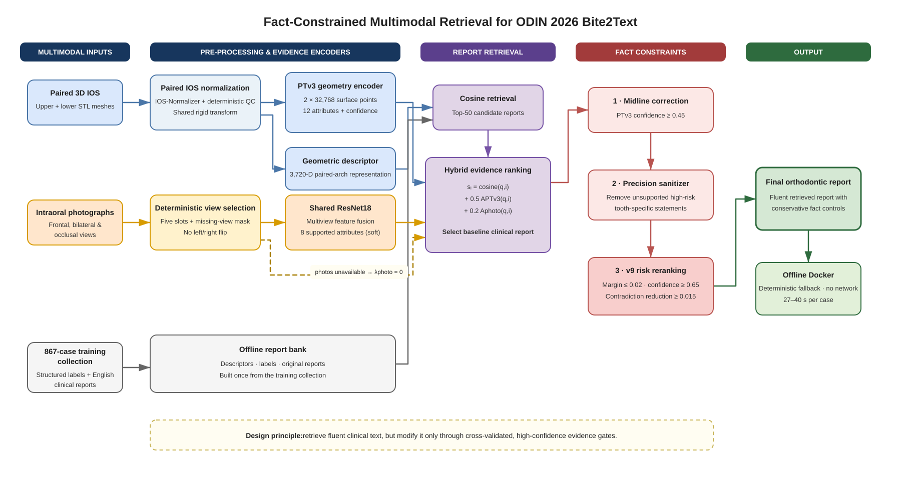

# ODIN 2026 Bite2Text

Reproducible source code and deployment entry points for `shayne`'s individual
submission to [ODIN 2026 Task 2 — Bite2Text](https://odin2026.grand-challenge.org/).
The method was developed by **Yan Sun**.

The final v9 system combines standardized intraoral-scan geometry, a Point
Transformer V3 (PTv3) structured predictor, multiview photographic evidence,
clinical-report retrieval, precision-oriented fact filtering, and conservative
contradiction-risk reranking.

- Grand Challenge method: [Bite2text Report](https://grand-challenge.org/algorithms/qwen3-vl-photo-orthodontic-report/)
- Final v9 evaluation: [3fac9821-fc34-45c4-bb1b-df4b912e28f7](https://odin2026.grand-challenge.org/evaluation/3fac9821-fc34-45c4-bb1b-df4b912e28f7/)
- Exact submitted algorithm source: [`0d0d83e`](https://github.com/Shayne-Pro/ODIN2026-Bite2Text/tree/0d0d83e1a962f361bc3b70e4d36ae129d338708b)

## Official challenge result

On the [ODIN 2026 Bite2Text final leaderboard](https://odin2026.grand-challenge.org/challenge-winners/),
`shayne` is listed 5th by Arena Score (942; win rate 41.9%) for submission
`e5588ed6`. The organizer-reported hidden-test metrics are RadFact-F1 `0.3795`,
BLEU-4 `0.2151`, METEOR `0.4512`, and aggregate score `0.3702`.

## Method overview



The editable source is available in
[`ODIN2026_Task2_Technical_Route.drawio`](figures/ODIN2026_Task2_Technical_Route.drawio).

## Final v9 configuration

| Component | Frozen setting |
|---|---:|
| Geometry retrieval | 3,720-D descriptor, cosine top-50 |
| PTv3 evidence | 12 heads, agreement coefficient `0.5` |
| Photo evidence | five views, 8 supported heads, coefficient `0.2` |
| Midline correction | confidence threshold `0.45` |
| Candidate score margin for risk reranking | `0.02` |
| Contradiction confidence threshold | `0.65` |
| Unsupported-sentence penalty | `0.005` |
| Contradiction-risk penalty | `0.5` |
| Minimum contradiction improvement | `0.015` |

In the historical five-fold development evaluation over 867 labeled cases,
v9 obtained BLEU-4 `0.2684` and METEOR `0.4700` with the organizer text evaluator.
Task-specific folds are patient-separated, but shared pretraining, view selection
and descriptor scaling mean this is **not fully nested end-to-end validation**.
See [the protocol and its limitations](reproducibility/README.md#evaluation-limitations-and-honest-claims).
These are development results, distinct from hidden-test metrics above.

## Repository structure

- `task2_bite2text/ptv3_finetune/`: PTv3 data preparation, training, and OOF evaluation.
- `task2_bite2text/photo_pipeline/`: multiview-photo training and multimodal evaluation.
- `task2_bite2text/hybrid_submission_v9_final/`: final Grand Challenge inference layer.
- `task2_bite2text/labeling/`: structured-label parser and schema.
- `task2_bite2text/radfact_glm_eval/`: local RadFact-Lite proxy adapter.
- `scripts/`: input auditing, IOS-normalization QA, and local smoke-test utilities.
- `report/`: five-page LNCS technical-report source.

Older submission directories are retained to document the progression from
geometry-only retrieval to the final multimodal, fact-constrained system.

## Technical report

The five-page LNCS source is
[`report/ODIN2026_Task2_shayne_TechnicalReport.tex`](report/ODIN2026_Task2_shayne_TechnicalReport.tex).
With [Tectonic](https://tectonic-typesetting.github.io/) installed, rebuild it
from the official LNCS class with:

```bash
mkdir -p output/pdf
cd report
tectonic --outdir ../output/pdf ODIN2026_Task2_shayne_TechnicalReport.tex
```

The report source preserves the 18 August 2026 snapshot, including its
then-unreleased v9 RadFact-F1 and final-score cells. The later official results
are recorded above rather than retroactively changing the report. Generated
PDF output is ignored by Git.

## Reproduce the final v9 submission (Q51 / Q54 / Q58)

Start with the [complete reproduction README](reproducibility/README.md).
It includes two routes: run the exact published submission, or rebuild from
authorized raw data through Bits2Bites pretraining, IOS normalization, weak
labels, PTv3/photo cross-validation, fixed full-867 training and retrieval assets.

- [Q51: complete image + model bundle](https://drive.google.com/file/d/1K4eBy1yikNn5vnwmpTz215F-FK8_KDiU/view)
- [Q54: self-trained model weights](https://drive.google.com/file/d/1gjF4qhSN8jg0XQ_ysvf9toVUjn4hxH4a/view)
- [Asset sizes, SHA-256 and exact submitted image ID](reproducibility/v9_assets.json)
- [Validation performed and remaining limits](reproducibility/validation/README.md)

Q54 alone cannot run the complete algorithm. The runtime needs **nine** files,
including `ios_normalizer_best.pt` and all three retrieval-bank files. These
assets remain outside Git; the download links do not change their license terms.

```bash
python3 scripts/v9_assets.py unpack-q51 artifacts/ODIN2026_Bite2Text_v9_Final_Submission.zip artifacts/v9-release
python3 scripts/v9_assets.py verify-model artifacts/v9-release/model
```

Follow Route A in the reproduction README to load the image and run an authorized
case offline. Source-image assembly remains `bash scripts/build_v9_image.sh`.
The bootstrap pins both upstreams and applies the checked-in compatibility and
training patches; a fresh checkout does not depend on private server edits.

## Source-level validation

These checks require no challenge data, credentials, weights, CUDA or PyTorch:

```bash
python3 -m venv .venv-tests
.venv-tests/bin/python -m pip install --requirement requirements-test.txt
.venv-tests/bin/python -m unittest discover -s tests -v
(
  cd task2_bite2text/hybrid_submission_v9_final
  ../../.venv-tests/bin/python -m unittest -v test_report_sanitizer.py test_risk_rerank.py
)
```

The 11 original decision-control tests are retained, with additional tests for
asset integrity, safe extraction, read-only input staging and geometry validation.
GitHub Actions runs the source tests on pull requests. Passing them is not a
claim that complete GPU retraining or hidden-test evaluation has been repeated.

## Input and output contract

The final container accepts paired upper/lower IOS meshes and an intraoral-photo
directory through the Grand Challenge input sockets. Missing or unreadable
photographs trigger a deterministic geometry-only fallback instead of failing
the case. The output contract is:

```json
{"report": "Generated orthodontic diagnostic report."}
```

## Data, security, and clinical-use statement

- API credentials are read only from environment variables and must never be committed.
- Patient-level images, meshes, reports, predictions, and cached LLM responses are excluded.
- The container does not require network access during inference.
- This project is for research and challenge evaluation only and is not a medical device.

## Upstream projects and licensing

- [Bits2Bites](https://github.com/AImageLab-zip/Bits2Bites), pinned at `8c3c685160c9cabe2462e9e23d2ffcd9ca78c63a`.
- [IOS-Normalizer](https://github.com/AImageLab-zip/IOS-Normalizer), pinned at `ecebe110a15081ea435e5970bbe6cf472d8f2882`.
- [RadFact-Lite](https://github.com/AImageLab-zip/radfact_lite), pinned by the local adapter at `053f680be1c57225f94d67b198a34aa871b1127d`.

See [`THIRD_PARTY_NOTICES`](THIRD_PARTY_NOTICES) for license texts and scope.
No challenge dataset, organizer evaluator, complete IOS-Normalizer source tree,
or pretrained third-party model is stored in Git. The IOS-Normalizer patch
contains only the changes needed against its pinned upstream; upstream terms
continue to apply.

Original project code is released under the [MIT License](LICENSE). This does
not grant rights to challenge data, patient records, reports, pretrained
weights, retrieval banks, or excluded upstream assets.
